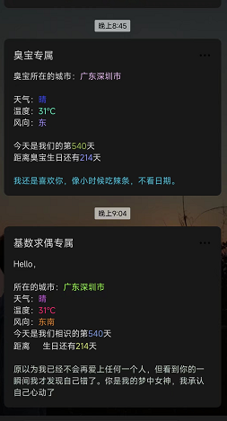
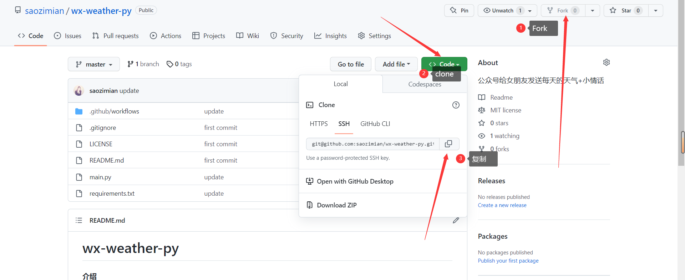
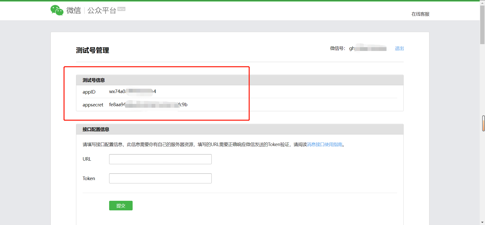
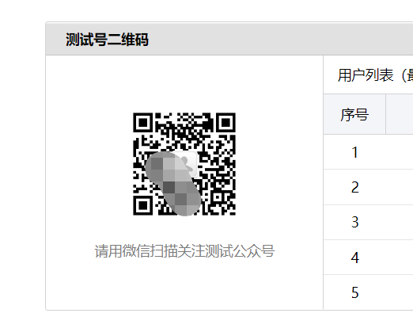
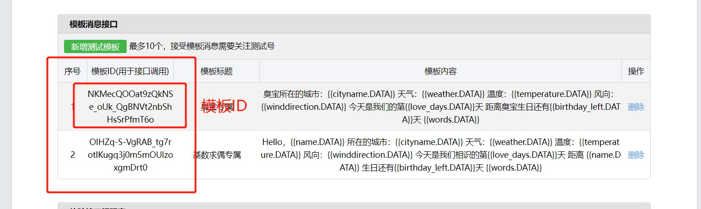
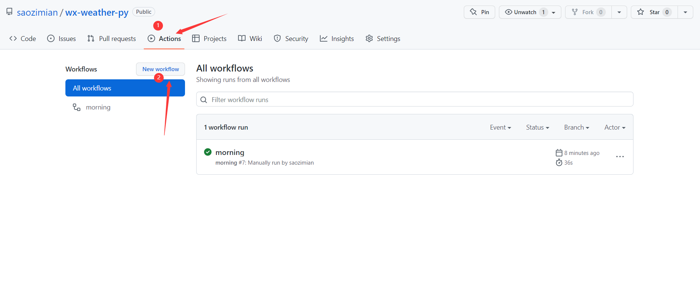
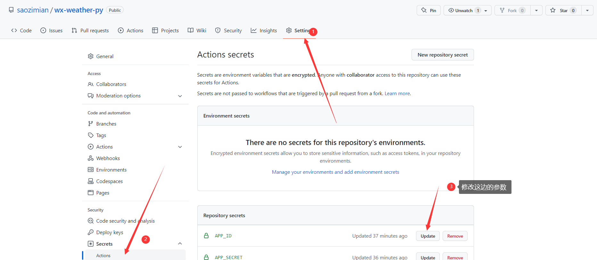
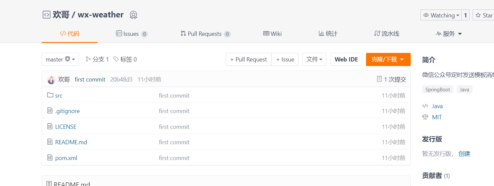

# wx-weather-py

#### 介绍

> 通过 微信公众号定时发送模板消息~~

## 食用方法

#### clone/fork 本项目

### 微信公众号测试参数获取

#### 二维码

**使用者必须先让他/她扫描关注这个二维码，关注之后右侧列表会显示对应的人员openid，
我们也可以通过接口获取这个人员id，也可以写在我们的配置文件中。**

#### 模板Id

#### 查看我们的定时任务

#### 修改参数

项目地址：https://github.com/saozimian/wx-weather-py

## Java版

> 项目地址：https://gitee.com/zhanghuan08/wx-weather

